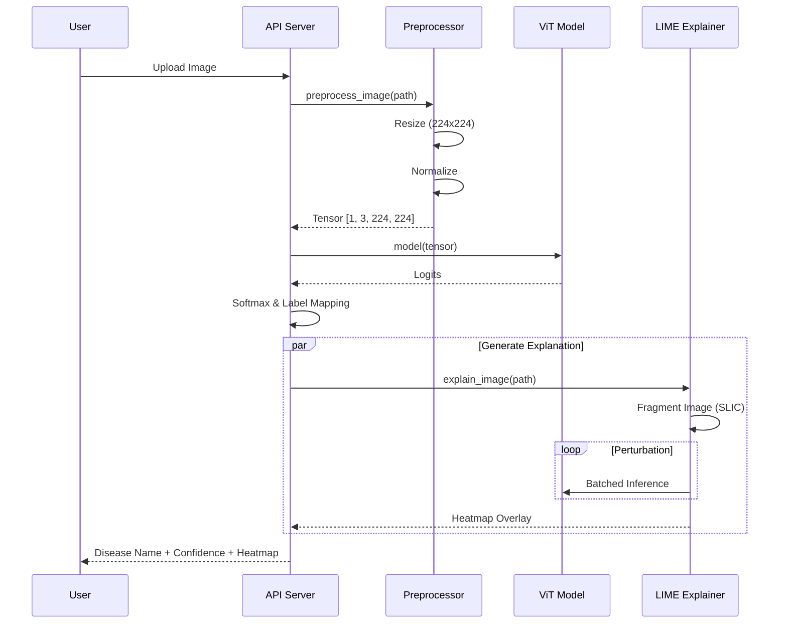

# Model Architecture & Prediction Flow

## 1. Model Overview

The application uses a **Vision Transformer (ViT)** architecture for classifying mango leaf diseases. Unlike traditional Convolutional Neural Networks (CNNs), ViT treats an image as a sequence of patches and processes them using self-attention mechanisms, allowing the model to capture global dependencies across the entire image.

### Key Specifications
- **Model Type**: Vision Transformer (ViT-Base/16 variant)
- **Input Resolution**: $224 \times 224$ pixels
- **Patch Size**: $16 \times 16$ pixels
- **Hidden Dimension (Embed Dim)**: 768
- **Layers (Depth)**: 12 Transformer Blocks
- **Attention Heads**: 12
- **Parameters**: ~86 Million (standard ViT-Base size)
- **Output Classes**: 8 (7 Diseases + Healthy)

---

## 2. Neural Network Architecture

The neural network is built using PyTorch and consists of the following key components:

### A. Patch Embedding Layer
*   **Input**: RGB Image ($224 \times 224 \times 3$).
*   **Operation**: The image is divided into a grid of $14 \times 14$ patches (total 196 patches).
*   **Projection**: Each $16 \times 16 \times 3$ patch is flattened and linearly projected into a vector of size **768**.
*   **Positional Embeddings**: Learnable vectors are added to each patch embedding to retain spatial information.
*   **Class Token**: A special learnable token (`[CLS]`) is prepended to the sequence. Its final state represents the entire image.

### B. Transformer Encoder (The Backbone)
The backbone consists of **12 stacked Transformer Blocks**. Each block contains:
1.  **Layer Normalization (LayerNorm)**: Stabilizes training.
2.  **Multi-Head Self-Attention (MSA)**:
    *   Allows each patch to "attend" to every other patch.
    *   Computes relationships between different parts of the leaf (e.g., connecting a spot on the left to a discoloration on the right).
3.  **Multi-Layer Perceptron (MLP)**:
    *   A feed-forward network with GELU activation.
    *   Expands the dimension to $3072$ temporarily to process features.
4.  **Residual Connections**: Skip connections around MSA and MLP layers.

### C. Classification Head
*   **Input**: The final output vector corresponding to the `[CLS]` token.
*   **LayerNorm**: Final normalization.
*   **Linear Layer**: Projects the 768-dim vector to the **8 class logits**.

### Architecture Diagram

```mermaid
graph TD
    subgraph Input_Processing
        img[Input Image\n224 x 224 x 3] --> patches[Patch Partition\n16x16 Patches]
        patches --> linear[Linear Projection\nFlatten -> 768 dim]
        pos[Positional Embeddings] --> add(+)
        cls[Class Token] --> add
        linear --> add
    end

    subgraph Transformer_Encoder [Transformer Encoder x12]
        add --> norm1[LayerNorm]
        norm1 --> msa[Multi-Head\nSelf Attention]
        msa --> add1((+))
        add --> add1
        
        add1 --> norm2[LayerNorm]
        norm2 --> mlp[MLP Block\nLinear -> GELU -> Linear]
        mlp --> add2((+))
        add1 --> add2
    end

    subgraph Prediction_Head
        add2 --> final_norm[LayerNorm]
        final_norm --> cls_extract{Extract [CLS]\nToken}
        cls_extract --> classifier[Linear Classifier\n768 -> 8 Classes]
        classifier --> logits[Logits]
    end

    style Input_Processing fill:#f9f,stroke:#333
    style Transformer_Encoder fill:#bbf,stroke:#333
    style Prediction_Head fill:#bfb,stroke:#333
```

---

## 3. Prediction Pipeline: Source to Result

How the system goes from a raw image file to a user-facing result.

### Step 1: Input & Preprocessing (`InferencePipeline.preprocess_image`)
1.  **Source**: Image file uploaded by the user.
2.  **Conversion**: Convert to RGB (handling PNG alpha channels).
3.  **Resize**: Image is resized to **224x224** pixels.
4.  **ToTensor**: Pixel values are converted to PyTorch Tensors ($0-1$ range).
5.  **Normalization**: Standard ImageNet normalization is applied:
    *   Mean: `[0.485, 0.456, 0.406]`
    *   Std: `[0.229, 0.224, 0.225]`

### Step 2: Model Inference (`ViT.forward`)
1.  The preprocessed tensor (`[1, 3, 224, 224]`) is passed to the model.
2.  The model computes the forward pass through all transformer layers.
3.  **Result**: A raw output vector (logits) of size 8.

### Step 3: Post-Processing
1.  **Softmax**: The logits are converted into probabilities (summing to 100%).
2.  **Argmax**: The index with the highest probability is selected as the predicted class.
3.  **Label Mapping**: The index (e.g., `0`) is mapped to the human-readable name (e.g., `"Anthracnose"`).

### Step 4: Explainability (LIME) (`LimeExplainer`)
*   **Segmentation**: The image is segmented into "superpixels" (groups of similar pixels) using the SLIC algorithm.
*   **Perturbation**: LIME generates thousands of variations by turning superpixels on/off.
*   **Observation**: The model predicts on these variations to see which superpixels change the confidence the most.
*   **Heatmap**: A visual mask is created to highlight the specific parts of the leaf responsible for the diagnosis.

### Prediction Flowchart


